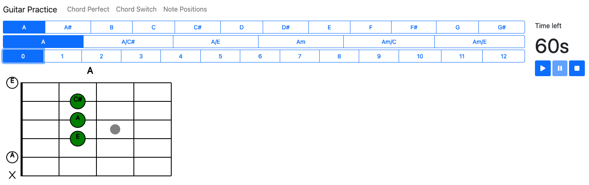
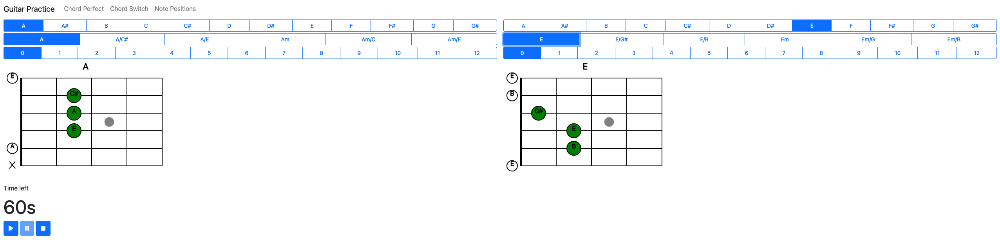
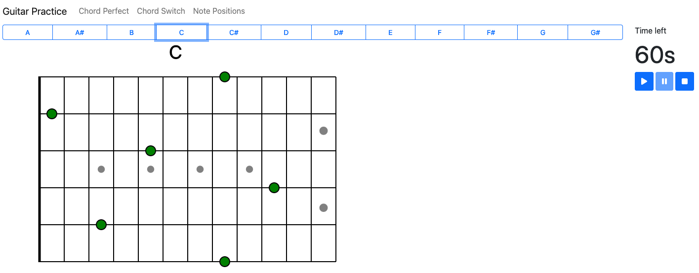

# Guitar Practice

A collection of exercises to practice guitar chords and notes, with a built-in timer.

## Run

```npm run dev```

## Exercises

### Chord perfect

Practice a single chord.



### Chord switch

Practice switching between two chords.



### Note positions

Memorize note positions on the fretboard.

